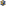

# EuroLFT Logo

The EuroLFT logo was agreed at the EuroLFT board meeting of 2027-05-27.
The logo incorporates a stylised two-dimensional projection of a four-dimensional cube
(tesseract);
this is the elementary unit of a four-dimensional cubic lattice.
The colours are inspired by,
although not identical to,
those of the [European flag](https://en.wikipedia.org/wiki/Flag_of_Europe),
representing EuroLFT's connection to all of Europe.

The following logo versions are included in this directory:

<table>
  <thead>
    <tr>
      <th>Logo</th>
      <th>Filename</th>
      <th>Notes</th>
    </tr>
  </thead>
  <tbody>
    <tr>
      <td style="text-align: center; background-color: white;"></td>
      <td><code>eurolft-colour-on-light.svg</code></td>
      <td>
        Colour version, for display on light backgrounds.
        "Main" logo;
        should be used by default unless there is a reason to use one of the below.
      </td>
    </tr>
    <tr>
      <td style="text-align: center; background-color: black;"></td>
      <td><code>eurolft-colour-on-dark.svg</code></td>
      <td>
        Colour version, for display on dark backgrounds.
        Should be used by default on dark backgrounds
        unless there is a reason to use one of the below.
      </td>
    </tr>
    <tr>
      <td style="text-align: center; background-color: white;"></td>
      <td><code>eurolft-mono-on-light.svg</code></td>
      <td>Monochrome version, for display on light backgrounds.</td>
    </tr>
    <tr>
      <td style="text-align: center; background-color: #fdac00;"></td>
      <td><code>eurolft-colour-on-yellow.svg</code></td>
      <td>
        Colour version, for display on yellow backgrounds.
        Should only be used on yellow backgrounds
        where there would be inadequate contrast with the yellow of the main logo.
      </td>
    </tr>
    <tr>
      <td style="text-align: center; background-color: navy;"></td>
      <td><code>eurolft-colour-on-blue.svg</code></td>
      <td>
        Colour version, for display on dark blue backgrounds.
        Should only be used on blue backgrounds
        where there would be inadequate contrast with the blue of the main logo.
      </td>
    </tr>
    <tr>
      <td style="text-align: center; background-color: black;"></td>
      <td><code>eurolft-mono-on-dark.svg</code></td>
      <td>Monochrome version, for display on dark backgrounds.</td>
    </tr>
    <tr>
      <td style="text-align: center; background-color: white;"></td>
      <td><code>eurolft-icon.svg</code></td>
      <td>
        Square icon, without text.
        Must only be used in contexts where the text "EuroLFT" will be adjacent;
        for example,
        in a GitHub profile.
      </td>
    </tr>
  </tbody>
</table>
